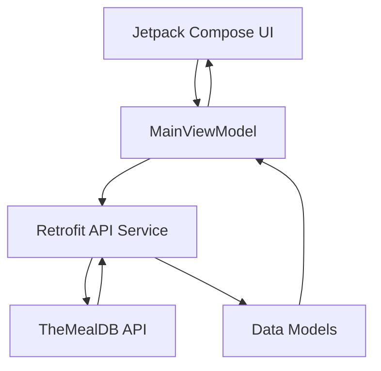

# 🍲 Recipe App Practice

A simple Android application built to practice **API integration, state management, and navigation using Jetpack Compose**.

The app fetches recipe categories from **TheMealDB API** and displays them in a responsive grid layout. Selecting a category opens a detailed screen showing the category image and description.

A short demo video of the app is included below.

---

# 📱 Demo

🎥 Demo Video

(Add your demo video or GIF here)

---

# ✨ Features

• Fetch recipe categories from an external API  
• Display categories in a responsive grid layout  
• Navigate to a category detail screen  
• Handle loading and error states  
• Smooth animated navigation transitions  
• Modern Android UI built with Jetpack Compose  

---

# 🛠 Tech Stack

### Language
- Kotlin

### UI
- Jetpack Compose
- Material 3

### Architecture
- MVVM (Model – View – ViewModel)

### Networking
- Retrofit
- Gson Converter

### Image Loading
- Coil

### Navigation
- Navigation Compose

---

# 🌐 API Used

The project uses the public API from:

TheMealDB

API Documentation  
https://www.themealdb.com/api.php

Endpoint used:

```
https://www.themealdb.com/api/json/v1/1/categories.php
```

---

# 🏗 Architecture

The project follows **MVVM Architecture**.

```
UI (Jetpack Compose)
        │
        ▼
ViewModel (State Management)
        │
        ▼
Repository / API Service
        │
        ▼
Retrofit
        │
        ▼
Remote API (TheMealDB)
```

---

# 📊 Architecture Diagram



---

# 📂 Project Structure

```
recipeapppractice
│
├── MainActivity.kt
├── RecipeApp.kt
│
├── MainViewModel.kt
│
├── APIService.kt
├── CategoryItem.kt
│
├── RecipeScreen.kt
├── CategoryDetail.kt
│
└── Screen.kt
```

---

# 📱 Screens

## Recipe Screen
Displays recipe categories in a grid.

Users can select a category to view more details.

## Detail Screen
Shows:
- Category image
- Category name
- Description

---

# 🎯 Learning Goals

This project was built primarily to practice:

- API integration in Android
- MVVM architecture
- State management in Jetpack Compose
- Navigation between composable screens
- Handling loading and error states
- Displaying remote images using Coil

---

# 🚀 Future Improvements

Possible enhancements for this project:

- Search recipes
- View meals inside categories
- Pagination support
- Skeleton loading UI
- Dark mode support
- Dependency Injection (Hilt)
- Offline caching with Room

---

# 👨‍💻 Author

**Kush**

Android Developer
